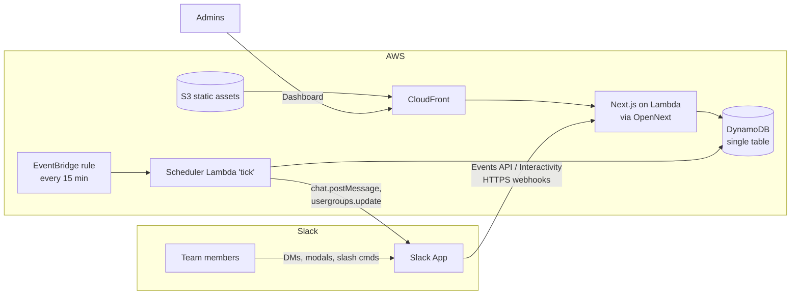

# Sprint Manager — Architecture & Delivery Plan

An in-house replacement for **Geekbot** (async daily standups) and **Rotation.app** (duty/on-call rotations), built for our org. Slack-first workflows, a web dashboard for admins, and a hard cost ceiling of **$5/month** on AWS.

---

## 1. Product scope

### 1.1 Async standups (Geekbot parity)

| Capability | MVP | Later |
|---|---|---|
| Define a standup: name, questions, participants, broadcast channel | ✅ | |
| Default template: "What did you do since last report? / What will you do today? / Any blockers? / How do you feel?" | ✅ | Custom per-question colors/emojis |
| Schedule: weekdays at HH:MM **in each participant's local timezone** | ✅ | Arbitrary cron, biweekly |
| Prompt each participant via Slack DM at their local time | ✅ | |
| Collect answers via a Block Kit **modal** (one form, all questions) | ✅ | Conversational one-question-at-a-time flow |
| Broadcast formatted report to a public/private channel as answers arrive | ✅ | Digest mode (one combined post) |
| Reminder nudge if no response after N hours; auto-close at end of day | ✅ | |
| Dashboard: reports by date/person, blocker highlighting | ✅ | Participation streaks, mood trends, export |
| Vacation/skip ("not today") | ✅ | Slack status / OOO auto-detection |

### 1.2 Rotations (Rotation.app parity)

| Capability | MVP | Later |
|---|---|---|
| Define a rotation: name, members (ordered), shift length (daily / weekdays / weekly / biweekly / monthly) | ✅ | Every-N-hours shifts |
| Round-robin advancement with fair ordering | ✅ | Load balancing by fewest recent shifts |
| Announce shift changes in a channel; DM the person coming on duty | ✅ | |
| Overrides: swap, skip, assign specific person for one shift | ✅ | Self-serve swap requests between members |
| "Who's on duty / who's next" — dashboard + `/rota who <name>` slash command | ✅ | |
| Maintain a Slack **user group** (e.g. `@oncall-payments`) pointing at the current person | ✅ | |
| Days-of-availability per member (e.g. no Fridays) | | ✅ |
| Calendar view / iCal feed | | ✅ |

### 1.3 Shared

- Sign in with Slack (OIDC) — no separate passwords; org workspace membership = access.
- Admin role (manage standups/rotations) vs member role (respond, view, swap own shifts).
- Everything manageable from the web dashboard; day-to-day interactions happen in Slack.

---

## 2. Architecture

### 2.1 Components

| Component | Technology | Role |
|---|---|---|
| **Web dashboard + API** | Next.js 15 (App Router), deployed with **OpenNext/SST** to Lambda + CloudFront + S3 | Admin UI (manage standups, rotations, view reports) and all HTTP APIs, including Slack webhook endpoints (`/api/slack/events`, `/api/slack/interactivity`, `/api/slack/commands`) |
| **Slack app** | Slack Web API + Events API (HTTP endpoints — no Socket Mode, since Lambda is request-driven) | DM prompts, response modals, channel broadcasts, slash commands, user-group sync |
| **Scheduler** | EventBridge rule → small Lambda, fires **every 15 minutes** | Finds standup prompts due in each user's timezone, reminders due, shifts rolling over; idempotent (marks work done in DynamoDB before sending) |
| **Database** | **DynamoDB**, single-table design, provisioned capacity inside the always-free tier | All entities below |
| **Auth** | Auth.js (NextAuth) with **Sign in with Slack** | Session for dashboard; Slack user id is the canonical identity everywhere |

**Why a 15-minute tick instead of one EventBridge schedule per user:** timezones and DST make per-user schedules churn constantly; a single idempotent sweep is simpler, debuggable, and costs nothing at our scale. Standup times are restricted to 15-minute increments (same as Geekbot in practice).

### 2.2 Data model (DynamoDB single table)

| Entity | PK | SK | Notes |
|---|---|---|---|
| Team settings | `TEAM` | `SETTINGS` | Workspace id, admin Slack ids |
| User | `USER#<slackId>` | `PROFILE` | Timezone (synced from Slack), availability days |
| Standup | `STANDUP#<id>` | `CONFIG` | Questions[], schedule, participants[], broadcast channel |
| Report (one per person per day) | `STANDUP#<id>` | `REPORT#<date>#<slackId>` | Answers[], status (pending/submitted/skipped), posted message ts |
| Rotation | `ROTA#<id>` | `CONFIG` | Members[], cadence, channel, Slack usergroup id |
| Shift | `ROTA#<id>` | `SHIFT#<startDate>` | Assignee, source (auto/override/swap) |
| GSI1 | `DUE#<yyyy-mm-dd-hh-mm>` | entity ref | Lets the tick Lambda query "what's due now" in one read |

Data volume is tiny (a few KB per report, per shift) — years of history fits in megabytes, nowhere near the 25 GB free cap.

### 2.3 Standup flow (happy path)

1. Tick Lambda finds `DUE` items → DMs each participant: intro + **"Answer standup"** button.
2. Button opens a Block Kit modal with all questions; submit → interactivity endpoint validates, writes `REPORT`, posts/updates the formatted report in the broadcast channel.
3. No answer by reminder time → one nudge DM. End of day → report marked `missed`.
4. Dashboard reads reports by standup/date; blockers (non-empty Q3) are flagged red and can optionally ping the manager.

### 2.4 Rotation flow

1. Tick Lambda detects a shift boundary → writes next `SHIFT` (respecting overrides/skips queued in the dashboard), updates the Slack user group, announces in the channel, DMs the incoming person.
2. `/rota who payments` answers instantly from DynamoDB. Overrides/swaps are done in the dashboard (MVP) and take effect at the next tick.

---

## 3. Hosting

Everything in **one AWS account, one region (ap-south-1 or us-east-1)**, deployed as a single SST (v3 / Ion) app:

- **CloudFront** in front of everything — static assets from S3, SSR/API from Lambda function URLs. Free tier (always free): 1 TB egress + 10M requests/month.
- **Lambda** — always free: 1M requests + 400k GB-s/month. A ~50-person org doing standups + a dashboard is a few thousand invocations/month.
- **DynamoDB** — always free: 25 GB + 25 RCU/25 WCU provisioned. We'll provision 5/5.
- **EventBridge** — the 15-min rule is ~2,900 invocations/month; free.
- **CloudWatch Logs** — set 2-week retention; within the 5 GB free ingest.
- **Domain (optional)**: use the default `*.cloudfront.net` URL for $0, or a Route 53 hosted zone at $0.50/month + ACM cert (free). Slack requires HTTPS either way — CloudFront provides it.

**Alternatives considered**
- *AWS Amplify Hosting*: simplest Next.js deploy, but its free tier expires after 12 months, then ~$0.15/GB served + build minutes. OpenNext on raw Lambda/CloudFront stays in **always-free** tiers.
- *Vercel free tier*: easiest of all, but the requirement is AWS, and Vercel's hobby tier prohibits commercial/org use.
- *ECS/Fargate or a small EC2 instance*: always-on compute blows the $5 budget immediately (~$9+/month minimum).

---

## 4. Cost breakdown

Assumes ~50 users, 5 standups, 5 rotations, dashboard used daily.

| Item | Free tier | Expected monthly cost |
|---|---|---|
| Lambda (SSR + API + tick) | 1M req always free | **$0** |
| CloudFront | 1 TB + 10M req always free | **$0** |
| S3 (static assets, ~50 MB) | 5 GB free 12 mo, then pennies | **$0.00–0.05** |
| DynamoDB (5 RCU/5 WCU provisioned) | 25/25 always free | **$0** |
| EventBridge rule | 14M/mo free | **$0** |
| CloudWatch Logs (2-wk retention) | 5 GB ingest free | **$0–0.30** |
| ACM certificate | Free | **$0** |
| Route 53 hosted zone *(optional)* | — | **$0.50** |
| Slack app | Free on any Slack plan | **$0** |
| **Total** | | **≈ $0–1/month** (worst case well under $5) |

Guardrails: an AWS **Budget alert at $3** and $5, and CloudFront + Lambda concurrency limits set low so a bug or abuse can't run up a bill.

For comparison: Geekbot ($2.50/user/mo ≈ $125/mo for 50 users) + Rotation.app (~$1/user/mo) — this pays for itself immediately.

---

## 5. Deployment & environments

- **IaC**: SST v3 — one `sst.config.ts` defines the Next.js site, DynamoDB table, EventBridge rule, tick Lambda, and secrets (Slack signing secret, bot token) via SST Secrets/SSM.
- **CI/CD**: GitHub Actions on this repo.
  - PR → lint, typecheck, unit tests, `sst diff`.
  - Merge to `main` → `sst deploy --stage prod`.
  - Auth to AWS via **GitHub OIDC role** — no long-lived keys in repo secrets.
- **Stages**: `dev` (personal, `sst dev` live-lambda for local iteration against a dev Slack app) and `prod`. Two Slack apps (dev/prod) pointing at the respective endpoints.
- **Slack app config**: managed as an [app manifest](https://api.slack.com/reference/manifests) checked into the repo (`slack-manifest.yml`) so scopes/endpoints are reviewable. Required bot scopes: `chat:write`, `im:write`, `commands`, `users:read`, `usergroups:read`, `usergroups:write`, `channels:read`.
- **Migrations**: none needed for DynamoDB; entity versioning field for forward compatibility.

---

## 6. Security

- Slack request **signature verification** on every webhook; reject >5-min-old timestamps (replay protection).
- Dashboard access restricted to our Slack workspace (team id check on OIDC login); admin allowlist in the `TEAM#SETTINGS` item.
- Bot token + signing secret in SSM SecretsManager-free SSM parameters (SecureString) — no secrets in code or env files.
- Least-privilege IAM per function; DynamoDB access scoped to the one table.
- No PII beyond Slack ids/names and standup text; everything stays in our AWS account.

---

## 7. Milestones

| Phase | Deliverable | Est. effort |
|---|---|---|
| 0 | Repo scaffolding: Next.js + SST, CI/CD with OIDC, deployed hello-world behind CloudFront | 1–2 days |
| 1 | Slack app + auth: sign-in with Slack, event/interactivity endpoints, signature verification | 2 days |
| 2 | **Standups MVP**: config UI, tick scheduler, DM + modal, channel broadcast, reminders | 4–5 days |
| 3 | **Rotations MVP**: config UI, shift rollover, announcements, user-group sync, overrides, `/rota` command | 3–4 days |
| 4 | Dashboard polish: report history, blocker view, budgets/alarms, runbook in README | 2 days |
| 5 | Later: mood analytics, load-balanced rotations, OOO detection, iCal feeds | ongoing |

---

*Next.js 15 · SST v3 (OpenNext) · DynamoDB · EventBridge · Slack Platform — target run cost ≈ $0–1/month.*
